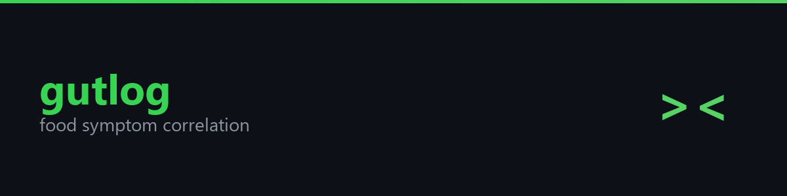
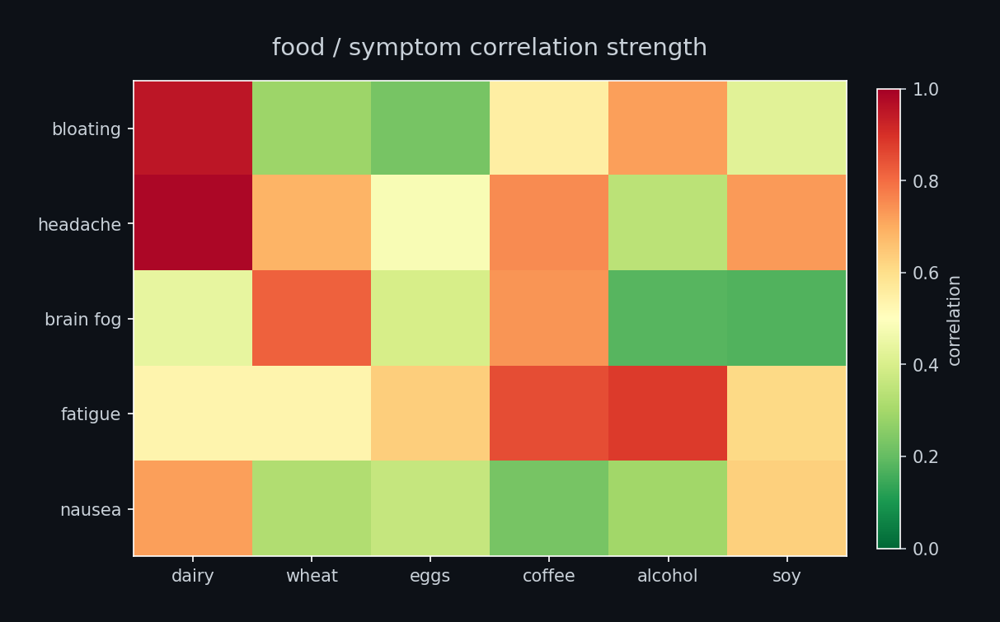
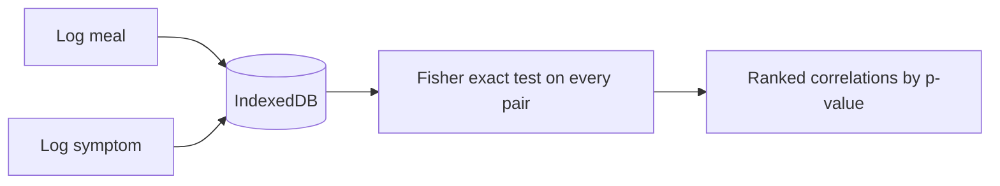

<p align="center">
  
</p>

<p align="center">
  <a href="https://github.com/zandenkane/gutlog/actions/workflows/ci.yml"></a>
  
  
</p>

you ever eat something and then feel terrible 3 hours later and have absolutely no idea which thing did it? was it the cheese? the bread? that suspicious gas station sushi? who knows.

gutlog does. log what you eat, log when you feel bad, and it runs actual statistics on the correlation. not vibes, not guessing. runs entirely in your browser, no server, no account, your diet stays between you and your IndexedDB.

## What it actually does

**Log meals.** Type what you ate in plain English. A built-in parser recognizes 91 foods and ingredients across 20 categories (dairy, gluten, grains, nuts, nightshades, eggs, soy, seafood, meat, fruits, vegetables, legumes, caffeine, alcohol, sugar, fermented, additives, oils, processed, supplements) and tags them automatically. You get chips showing what it detected so you can verify.

**Log symptoms.** Pick from a preset list (headache, bloating, fatigue, nausea, brain fog, joint pain, skin irritation, stomach pain, diarrhea, congestion) or type your own. Rate severity 1 to 5. Set the time it happened.

**See your summary.** Total meals, symptoms, unique foods, days tracked. Top logged foods and symptoms at a glance.

**Run the analysis.** The engine builds a 2x2 contingency table for every food/symptom pair, runs Fisher's exact test, computes odds ratios with 95% confidence intervals, and ranks results by statistical significance. You pick the time window (3h, 6h, 12h, 24h, 48h, or 72h) depending on how delayed your reactions tend to be. Pairs with fewer than 3 co-occurrences get filtered out so you are not staring at noise.

**Export and import.** Download your data as JSON. Import it back on another device or browser. That is the entire backup strategy and it works fine.


<p align="center">
  
</p>


## example

```
$ # after 2 weeks of logging meals and symptoms:

gutlog analyze

food             symptom        p-value    correlation
dairy            bloating       0.003      strong
wheat            brain fog      0.018      moderate
eggs             headache       0.421      none
coffee           anxiety        0.031      moderate
alcohol          fatigue        0.008      strong

significant correlations (p < 0.05): 4 found
suggestion: try eliminating dairy for 2 weeks and log again
```



## Reading the results

After a week or two of logging, you run the analysis and get a table like:

| Food | Symptom | p value | Strength | Odds Ratio | 95% CI |
|------|---------|---------|----------|------------|--------|
| cheese | bloating | 0.003 | strong | 8.50 | 2.10 to 34.40 |

That means on days you ate cheese, you were 8.5x more likely to report bloating. The p value of 0.003 means there is a very small chance that pattern is random.

Strength labels: very strong (p < 0.001), strong (p < 0.01), moderate (p < 0.05), weak (p < 0.1), not significant (p >= 0.1).

More data gives you better results. A few days is not enough. Two weeks of consistent logging starts to show real patterns.

## Setup

```bash
git clone https://github.com/zandenkane/gutlog.git
cd gutlog
npm install
npm run dev
```

Open `http://localhost:5173`.

## Build

```bash
npm run build
```

Output goes to `dist/`. Serve with any static file server.

## Tests

```bash
npm test
```

86 tests covering the food parser, statistical functions, correlation engine, database layer, and data export/import.

## Stack

Preact, Dexie.js (IndexedDB), Vite, vite-plugin-pwa, Vitest, TypeScript strict mode.

## License

MIT
